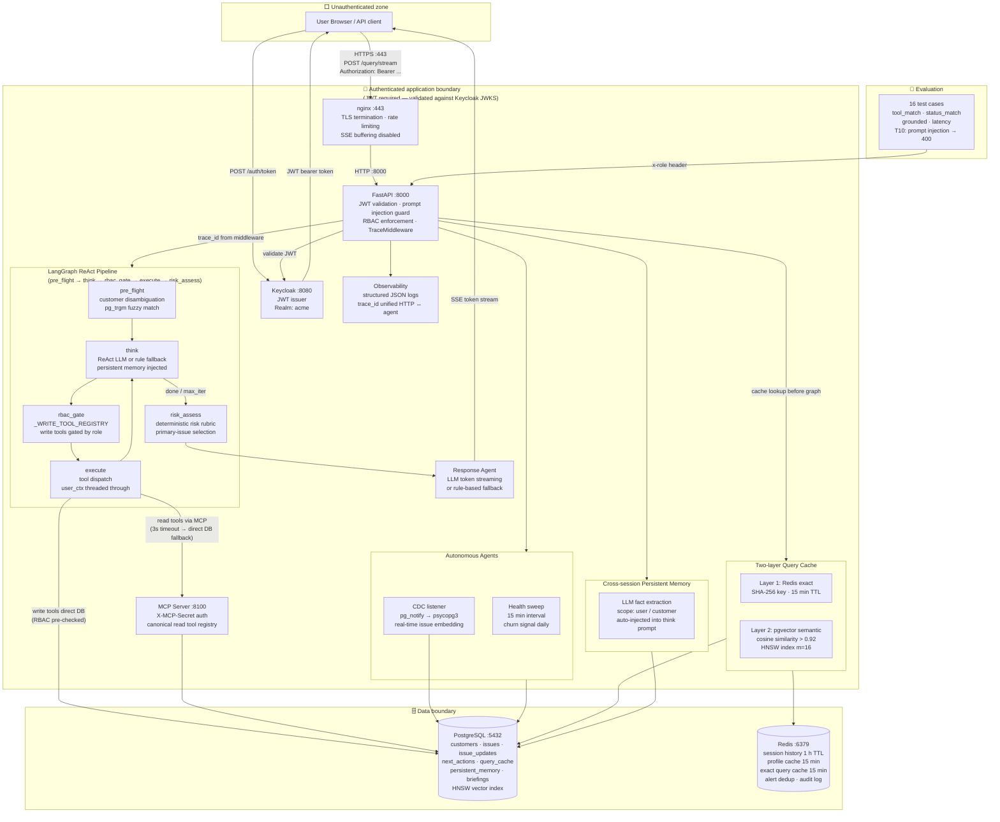

# Architecture

## System diagram with trust boundaries

---

## LangGraph ReAct pipeline + bounded 3-agent workflow

The orchestrator uses a LangGraph `StateGraph` with a 5-node bounded ReAct loop:

| Node | File | Responsibility |
|---|---|---|
| `pre_flight` | `graph_orchestrator.py` | Customer disambiguation (pg_trgm fuzzy match); emits SSE `disambiguation` event if >1 match |
| `think` | `graph_orchestrator.py` | LLM ReAct reasoning (OpenAI gpt-4.1-mini, max_retries=3) with persistent memory injected; falls back to deterministic rule planner if key absent |
| `rbac_gate` | `graph_orchestrator.py` | Checks `_WRITE_TOOL_REGISTRY` before any write tool executes; returns 403 if role insufficient |
| `execute` | `graph_orchestrator.py` | Dispatches tool, passes `user_ctx` for RLS; MCP read path (3s timeout) → direct DB fallback |
| `risk_assess` | `graph_orchestrator.py` | Deterministic Risk/Action Agent; primary-issue selection; risk rubric; terminates the loop |

Downstream agents:

| Agent | File | Responsibility |
|---|---|---|
| Risk/Action Agent | `app/agents/risk_action_agent.py` | Selects primary issue deterministically; applies risk rubric; produces `{selected_primary_issue, risk_level, urgency, rationale, recommendation}` |
| Response Agent | `app/services/answer_synthesizer.py` | Streams tokens (SSE) via LLM; falls back to rule-based answer if LLM unavailable; never invents facts |

**What stays centralised — and why:**

- **Tool execution** is in the `execute` graph node. LLMs select tools but never execute them — RBAC is enforced by `rbac_gate` before every write.
- **Write-tool RBAC** uses `_WRITE_TOOL_REGISTRY` as single source of truth; a startup assertion verifies all registered tools exist in `TOOL_MAP`.
- **Deterministic rule fallback** exists at both the planning and response stages. If OpenAI is unavailable, the system degrades gracefully.

**What is intentionally bounded:**

- Maximum 6 ReAct iterations per query (`MAX_ITERATIONS = 6`).
- At most one bounded follow-up (history fetched for primary issue only).
- All writes remain in the app layer; MCP is read-only.

---

## Component responsibilities

| Component | Role |
|---|---|
| Keycloak | Issues JWT bearer tokens; holds realm roles (`sales_user`, `support_user`, `admin`) |
| FastAPI app | Accepts queries, validates JWT via JWKS; `TraceMiddleware` generates unified `trace_id`; prompt injection guard (15 patterns) blocks before any LLM call |
| LangGraph orchestrator | 5-node `StateGraph` ReAct loop (`graph_orchestrator.py`); max 6 iterations; compiles once at import, reused per request |
| Risk/Action Agent | Deterministic primary-issue selection (severity → status → newest); risk rubric; logs `agent_stage: risk_action_agent` |
| Response Agent | LLM token streaming (SSE) with rule-based fallback; logs `agent_stage: response_agent` |
| Tool Functions | Thin SQLAlchemy wrappers; parameterised queries; `user_ctx` threaded through for RLS |
| Two-layer Query Cache | Layer 1: Redis exact (SHA-256, 15 min TTL); Layer 2: pgvector semantic (cosine > 0.92, HNSW m=16) |
| Persistent Memory | LLM extracts cross-session facts post-run; injected into `think` prompt; scoped `user:{name}` / `customer:{name}` |
| Redis | Session history (1 h), profile cache (15 min), exact query cache, alert dedup, trace steps, audit write log |
| MCP Server | Canonical read tool registry; `X-MCP-Secret` auth header; 5 endpoints; 3s timeout → direct DB fallback |
| PostgreSQL | Durable store: customers, issues, issue_updates, next_actions, query_cache, persistent_memory, briefings, health_snapshots |
| CDC Listener | `psycopg3` LISTEN on `issue_updated` / `issue_note_added`; embeds issues in real-time via OpenAI |
| Autonomous Agent | Health sweep every 15 min; churn signal daily; writes `briefings` table; deduped at 30 min |
| Observability | Structured JSON to stdout: `agent_output`, `tool_call`, `request_trace`, `migration_error`; `trace_id` unified HTTP↔agent |
| Evaluation Harness | 16 test cases: tool routing, RBAC, grounding, prompt injection (T10→400), semantic search, status filters, admin role |

---

## Trust boundary notes

**Unauthenticated zone → App boundary**
All user-facing traffic enters through nginx on port 443 (HTTPS, TLS terminated by self-signed cert). nginx proxies to `acme-app:8000` on the internal Docker network. The app then requires a valid Keycloak JWT or (in `APP_ENV=local` only) an explicit `x-role` header. Missing or invalid tokens return HTTP 401 before any business logic runs.

*Note: Keycloak itself (`:8080`) and the MCP server (`:8100`) are not behind the nginx TLS proxy in this local configuration. In production, each service would be TLS-terminated at a shared gateway.*

**App boundary → Data boundary**
Tool functions use parameterised SQL. No user-controlled string is interpolated into queries. Redis keys are namespaced (`session:`, `customer:`).

**LLMs are not a security boundary**
The Planning Agent selects tools; RBAC is enforced by the orchestrator after planning. An adversarial query that tricks the LLM into planning `recommend_next_action` for a `sales_user` will still receive HTTP 403.

---

## MCP integration — current execution routing

The MCP server runs at `:8100` and exposes 5 endpoints:

| Endpoint | Tool | Notes |
|---|---|---|
| `GET /tools` | — | Canonical registry (names, descriptions, endpoint paths) |
| `GET /customer/{name}` | `get_customer_profile` | Routed via MCP; Redis cache checked first |
| `GET /issues/{name}` | `get_open_issues` | Routed via MCP |
| `GET /history/{issue_id}` | `get_issue_history` | Routed via MCP |
| `GET /issues?severity=&statuses=` | `list_all_open_issues` | Routed via MCP; filters passed as query params |

**Fallback:** If MCP is unavailable (timeout ≤ 3 s or connection error), all read tools fall back to direct PostgreSQL queries. The `via` field in `tool_call` log events shows `"mcp"`, `"cache"`, or `"direct_db_fallback"`.

**Why write tools stay direct:** `recommend_next_action` requires server-side RBAC enforcement before execution. Routing writes through MCP would require MCP to understand and enforce role claims — an auth-aware gateway concern, not appropriate for a prototype read-only MCP server.

---

## Deterministic primary-issue selection

The Risk/Action Agent selects one primary issue when a customer has multiple open issues. Selection is fully deterministic — same input always produces the same result:

1. **Highest severity** (`critical` > `high` > `medium` > `low`)
2. **Most-active status** (`open` > `in_progress` > `waiting` > `resolved`)
3. **Highest issue ID** (most recently created) as tiebreaker

The selected issue is used for `get_issue_history` and `recommend_next_action` calls, and is included in the `risk_action_agent` structured output and logs.

---

## RBAC matrix

| Role | get_customer_profile | get_open_issues | get_issue_history | list_all_open_issues | recommend_next_action |
|---|---|---|---|---|---|
| sales_user | ✓ | ✓ | ✓ | ✓ | ✗ (403) |
| support_user | ✓ | ✓ | ✓ | ✓ | ✓ |
| admin | ✓ | ✓ | ✓ | ✓ | ✓ |

Enforcement location: `app/agents/graph_orchestrator.py` — `_rbac_gate` node checks `_WRITE_TOOL_REGISTRY` before every write tool dispatch; validated at startup by an assertion against `TOOL_MAP`.

---

## Risk rubric (Risk/Action Agent)

| Signal | Risk floor raised to |
|---|---|
| Any critical-severity issue | Critical |
| Account health = red | Critical |
| Any high-severity issue | High |
| Amber health + multiple issues | High |
| Medium-severity issue | Medium |
| Multiple open issues (> 1) | Medium |
| No issue history on record | Medium |
| Last update > 7 days ago | Medium |

Additional outputs: `rationale`, `urgency` (routine / within 48 h / today / immediate), `owner_suggestion`, `evidence_used` (issue IDs, source tables).

---

## Redis key patterns

| Key pattern | Content | TTL | Purpose |
|---|---|---|---|
| `session:{session_id}` | `{"history":[{query, plan, steps, answer, trace_id},...]}` | 3600 s | Conversation / session memory |
| `customer:{name_lower}` | `{id, name, segment, account_owner, health_status}` | 900 s | Profile cache — avoids repeated DB reads |
| `qcache:exact:{sha256}` | `{answer, plan}` | 900 s | Layer-1 exact query cache (SHA-256 of query+roles+customer) |
| `alert:{customer}:{type}` | `1` | 3600 s | Alert dedup — same alert won't re-fire within 1 hour |
| `trace:{trace_id}:{node}` | `{delta JSON}` | 3600 s | Per-node trace steps for horizontal scaling / debugging |
| `audit:write:{trace_id}` | `{tool, user, args, timestamp}` | 86400 s | Immutable write audit log |

---

## What would be hardened in production

1. **JWKS caching** — current cache is process-level and never refreshed; production needs background refresh with graceful key rotation
2. **MCP auth** — `X-MCP-Secret` shared secret is in `.env`; production would use mTLS or a secrets manager
3. **Write tools via MCP** — `recommend_next_action` remains app-layer only; move to MCP only once MCP understands role claims
4. **Audience validation** — `verify_aud: False` is acceptable for this single-client setup; production with multiple clients needs strict audience checking
5. **Async tool execution** — independent tool calls (e.g. `get_customer_profile` + `list_all_open_issues`) could be parallelised
6. **Distributed tracing** — `trace_id` unified across HTTP and agent; production would export to OTEL/Jaeger
7. **Session persistence** — Redis TTL means session history is lost after 1 h; production needs durable session storage
8. **Rate limiter** — Redis-backed slowapi enforces per-user limits across all pods; Redis password auth already configured
9. **Persistent memory expiry** — 30-day user / 60-day customer TTL; production may want longer retention for key account context
