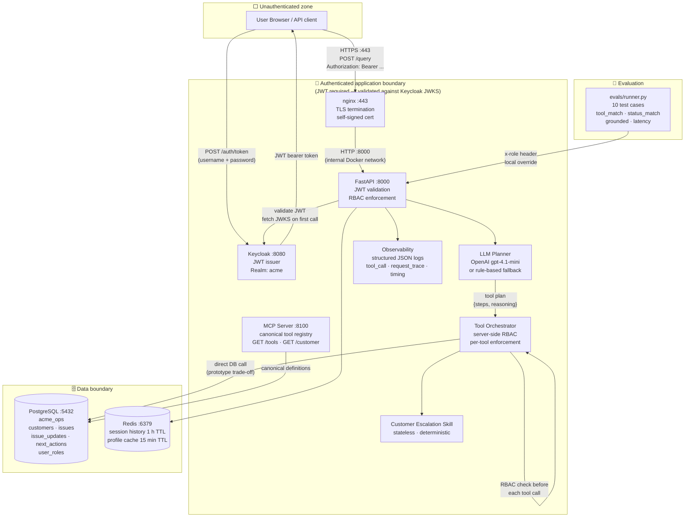

# Architecture

## System diagram with trust boundaries

---

## Component responsibilities

| Component | Role |
|---|---|
| Keycloak | Issues JWT bearer tokens; holds realm roles (`sales_user`, `support_user`, `admin`) |
| FastAPI app | Accepts queries, validates JWT via JWKS, routes to orchestrator |
| LLM Planner | Builds a structured tool plan from the user query; uses OpenAI if configured, falls back to rule-based keyword planner |
| Tool Orchestrator | Executes the plan step-by-step; enforces RBAC inline before each tool call |
| Tool Functions | Thin SQLAlchemy wrappers over PostgreSQL; parameterised queries only |
| Customer Escalation Skill | Stateless, deterministic workflow — applies documented risk rubric (severity, health, staleness, issue count) |
| Redis | Short-lived session history (1 h TTL) and customer profile cache (15 min TTL) |
| MCP Server | Exposes the canonical tool registry (`GET /tools`) and a customer lookup endpoint (`GET /customer/{name}`) |
| PostgreSQL | Durable store: customers, issues, issue_updates, next_actions, user_roles |
| Observability | Structured JSON to stdout: `tool_call`, `request_trace`, `timing` — includes `status_code` and `elapsed_ms` |
| Evaluation Harness | 10 test cases: tool routing, RBAC, grounding, prompt injection, unknown customer |

---

## Trust boundary notes

**Unauthenticated zone → App boundary**
All user-facing traffic enters through nginx on port 443 (HTTPS, TLS terminated by self-signed cert). nginx proxies to `app:8000` on the internal Docker network. The app then requires a valid Keycloak JWT or (in `APP_ENV=local` only) an explicit `x-role` header. Missing or invalid tokens return HTTP 401 before any business logic runs.

*Note: Keycloak itself (`:8080`) and the MCP server (`:8100`) are not behind the nginx TLS proxy in this local configuration. Keycloak is a support service for token issuance; the UI signs in by calling it directly via HTTP. In production, each service would be TLS-terminated at a shared gateway.*

**App boundary → Data boundary**
Tool functions use parameterised SQL. No user-controlled string is interpolated into queries. Redis keys are namespaced (`session:`, `customer:`).

**LLM is not a security boundary**
The planner selects tools based on the query. RBAC is enforced by the orchestrator after planning. An adversarial query that tricks the LLM into planning `recommend_next_action` for a `sales_user` will still receive HTTP 403 from the orchestrator.

---

## MCP integration — current execution routing

The MCP server runs at `:8100` and exposes:
- `GET /tools` — canonical tool registry (names, descriptions, endpoint paths)
- `GET /customer/{name}` — customer profile lookup ← **routed via MCP**
- `GET /issues/{name}` — open issues for a customer ← **routed via MCP**

**Current behaviour:** `get_customer_profile` and `get_open_issues` execute through the MCP HTTP server. The app calls `GET /customer/{name}` and `GET /issues/{name}` on MCP, not PostgreSQL directly. `get_issue_history` and `recommend_next_action` still use direct DB.

**Execution path:** App → MCP HTTP call → MCP → PostgreSQL

**Fallback:** If MCP is unavailable (timeout or connection error within 3 s), both tools fall back to direct PostgreSQL queries. The `via` field in `tool_call` log events shows `"mcp"`, `"cache"`, or `"direct_db_fallback"`.

**Why write tools stay direct:** `recommend_next_action` requires server-side RBAC enforcement before execution. Routing writes through MCP would require MCP to understand and enforce role claims — a non-trivial change that belongs in a production auth-aware gateway, not a prototype MCP server.

**Remaining gap:** `get_issue_history` is not yet routed via MCP (no `/history/{issue_id}` endpoint defined). Adding it follows the same pattern as `get_open_issues`.

---

## RBAC matrix

| Role | get_customer_profile | get_open_issues | get_issue_history | recommend_next_action |
|---|---|---|---|---|
| sales_user | ✓ | ✓ | ✓ | ✗ (403) |
| support_user | ✓ | ✓ | ✓ | ✓ |
| admin | ✓ | ✓ | ✓ | ✓ |

Enforcement location: `app/agents/orchestrator.py:42` — `require_role(user_ctx, ['support_user', 'admin'])`

---

## Customer Escalation Skill — risk rubric

| Signal | Risk floor raised to |
|---|---|
| Any critical-severity issue | Critical |
| Account health = red | Critical |
| Any high-severity issue | High |
| Amber health + multiple issues | High |
| Medium-severity issue | Medium |
| Multiple open issues (> 1) | Medium |
| No issue history on record | Medium |
| Last update > 7 days ago | Medium |

Additional outputs: `risk_rationale`, `urgency` (routine / within 48 h / today / immediate), `owner_suggestion`, `evidence_used` (issue IDs, source tables).

---

## Redis key patterns

| Key pattern | Content | TTL | Purpose |
|---|---|---|---|
| `session:{session_id}` | `{"history":[{query, plan, steps, answer},...]}` | 3600 s | Conversation / session memory |
| `customer:{name_lower}` | `{id, name, segment, account_owner, health_status}` | 900 s | Profile cache — avoids repeated DB reads |

On cache miss: re-fetch from PostgreSQL and repopulate. Session state: built up turn-by-turn; lost on TTL expiry (intentional for demo).
