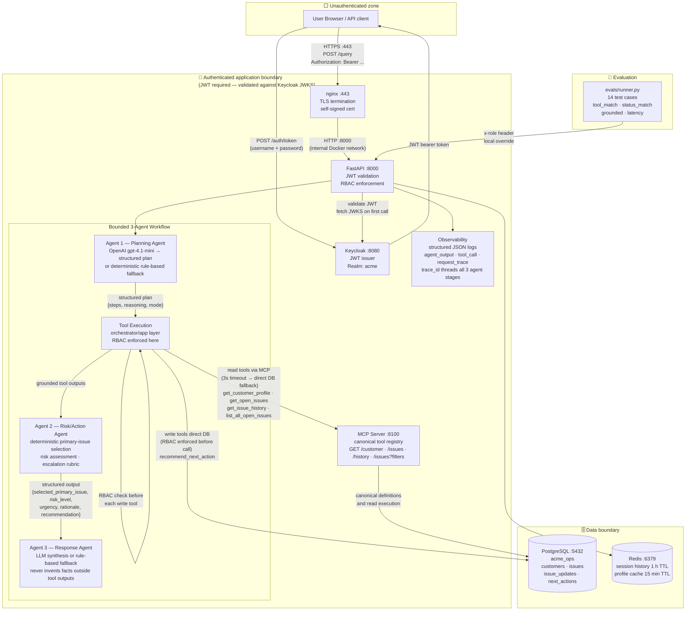

# Architecture

## System diagram with trust boundaries

---

## Bounded 3-agent workflow

| Agent | File | Responsibility |
|---|---|---|
| Planning Agent | `app/agents/planner.py` | Interprets the user query; decides which tools are needed (cross-customer vs single-customer, history, write); produces structured `{steps, reasoning, planner_mode}` |
| Risk/Action Agent | `app/agents/risk_action_agent.py` | Consumes grounded tool outputs; selects the primary issue deterministically; applies the risk rubric; produces `{selected_primary_issue, risk_level, urgency, rationale, recommendation}` |
| Response Agent | `app/services/answer_synthesizer.py` | Consumes Risk/Action Agent output and all tool outputs; synthesises the final user-facing answer via LLM; falls back to deterministic rule-based answer if LLM unavailable; never invents facts |

**What stays centralised — and why:**

- **Tool execution** remains in `orchestrator.py` (app layer). LLMs select tools but never execute them. This keeps RBAC enforcement in one place.
- **Write-tool RBAC** is enforced in the orchestrator before `recommend_next_action` is called. An adversarial LLM plan cannot bypass this.
- **Deterministic rule fallback** exists at both the planning and response stages. If OpenAI is unavailable, the system degrades gracefully rather than failing.

**What is intentionally bounded in this prototype:**

- Exactly 3 agents — no swarm, no recursive planning loop, no unbounded retries.
- At most one bounded follow-up decision per query (history fetched for primary issue only).
- All writes remain in the app layer; MCP is read-only.

---

## Component responsibilities

| Component | Role |
|---|---|
| Keycloak | Issues JWT bearer tokens; holds realm roles (`sales_user`, `support_user`, `admin`) |
| FastAPI app | Accepts queries, validates JWT via JWKS, routes to orchestrator |
| Planning Agent | Builds a structured tool plan; OpenAI gpt-4.1-mini with rule-based fallback; logs `agent_stage: planning_agent` |
| Tool Orchestrator | Executes the plan step-by-step; enforces RBAC inline before write tools |
| Risk/Action Agent | Deterministic primary-issue selection (severity → status → newest); risk rubric; logs `agent_stage: risk_action_agent` |
| Response Agent | LLM answer synthesis with rule-based fallback; logs `agent_stage: response_agent` |
| Tool Functions | Thin SQLAlchemy wrappers over PostgreSQL; parameterised queries only |
| Redis | Short-lived session history (1 h TTL) and customer profile cache (15 min TTL) |
| MCP Server | Canonical tool registry + 4 read endpoints (`/customer`, `/issues/{name}`, `/history/{issue_id}`, `/issues?filters`) |
| PostgreSQL | Durable store: customers, issues, issue_updates, next_actions |
| Observability | Structured JSON to stdout: `agent_output` (with `trace_id`), `tool_call` (with `via`), `request_trace`, `timing` |
| Evaluation Harness | 14 test cases: tool routing, RBAC, grounding, prompt injection, unknown customer, status filters, MCP paths, history path |

---

## Trust boundary notes

**Unauthenticated zone → App boundary**
All user-facing traffic enters through nginx on port 443 (HTTPS, TLS terminated by self-signed cert). nginx proxies to `acme-app:8000` on the internal Docker network. The app then requires a valid Keycloak JWT or (in `APP_ENV=local` only) an explicit `x-role` header. Missing or invalid tokens return HTTP 401 before any business logic runs.

*Note: Keycloak itself (`:8080`) and the MCP server (`:8100`) are not behind the nginx TLS proxy in this local configuration. In production, each service would be TLS-terminated at a shared gateway.*

**App boundary → Data boundary**
Tool functions use parameterised SQL. No user-controlled string is interpolated into queries. Redis keys are namespaced (`session:`, `customer:`).

**LLMs are not a security boundary**
The Planning Agent selects tools; RBAC is enforced by the orchestrator after planning. An adversarial query that tricks the LLM into planning `recommend_next_action` for a `sales_user` will still receive HTTP 403.

---

## MCP integration — current execution routing

The MCP server runs at `:8100` and exposes 5 endpoints:

| Endpoint | Tool | Notes |
|---|---|---|
| `GET /tools` | — | Canonical registry (names, descriptions, endpoint paths) |
| `GET /customer/{name}` | `get_customer_profile` | Routed via MCP; Redis cache checked first |
| `GET /issues/{name}` | `get_open_issues` | Routed via MCP |
| `GET /history/{issue_id}` | `get_issue_history` | Routed via MCP |
| `GET /issues?severity=&statuses=` | `list_all_open_issues` | Routed via MCP; filters passed as query params |

**Fallback:** If MCP is unavailable (timeout ≤ 3 s or connection error), all read tools fall back to direct PostgreSQL queries. The `via` field in `tool_call` log events shows `"mcp"`, `"cache"`, or `"direct_db_fallback"`.

**Why write tools stay direct:** `recommend_next_action` requires server-side RBAC enforcement before execution. Routing writes through MCP would require MCP to understand and enforce role claims — an auth-aware gateway concern, not appropriate for a prototype read-only MCP server.

---

## Deterministic primary-issue selection

The Risk/Action Agent selects one primary issue when a customer has multiple open issues. Selection is fully deterministic — same input always produces the same result:

1. **Highest severity** (`critical` > `high` > `medium` > `low`)
2. **Most-active status** (`open` > `in_progress` > `waiting` > `resolved`)
3. **Highest issue ID** (most recently created) as tiebreaker

The selected issue is used for `get_issue_history` and `recommend_next_action` calls, and is included in the `risk_action_agent` structured output and logs.

---

## RBAC matrix

| Role | get_customer_profile | get_open_issues | get_issue_history | list_all_open_issues | recommend_next_action |
|---|---|---|---|---|---|
| sales_user | ✓ | ✓ | ✓ | ✓ | ✗ (403) |
| support_user | ✓ | ✓ | ✓ | ✓ | ✓ |
| admin | ✓ | ✓ | ✓ | ✓ | ✓ |

Enforcement location: `app/agents/orchestrator.py` — `require_role(user_ctx, ['support_user', 'admin'])` called before `recommend_next_action` is dispatched.

---

## Risk rubric (Risk/Action Agent)

| Signal | Risk floor raised to |
|---|---|
| Any critical-severity issue | Critical |
| Account health = red | Critical |
| Any high-severity issue | High |
| Amber health + multiple issues | High |
| Medium-severity issue | Medium |
| Multiple open issues (> 1) | Medium |
| No issue history on record | Medium |
| Last update > 7 days ago | Medium |

Additional outputs: `rationale`, `urgency` (routine / within 48 h / today / immediate), `owner_suggestion`, `evidence_used` (issue IDs, source tables).

---

## Redis key patterns

| Key pattern | Content | TTL | Purpose |
|---|---|---|---|
| `session:{session_id}` | `{"history":[{query, plan, steps, answer, trace_id},...]}` | 3600 s | Conversation / session memory |
| `customer:{name_lower}` | `{id, name, segment, account_owner, health_status}` | 900 s | Profile cache — avoids repeated DB reads |

---

## What would be hardened in production

1. **JWKS caching** — current cache is process-level and never refreshed; production needs background refresh with graceful key rotation
2. **MCP auth** — MCP server is unauthenticated; production would require mTLS or a shared secret between app and MCP
3. **Write tools via MCP** — `recommend_next_action` could move to MCP once MCP understands role claims (auth-aware gateway)
4. **Audience validation** — `verify_aud: False` is acceptable for this single-client setup; production with multiple clients needs strict audience checking
5. **Async tool execution** — sequential tool calls could be parallelised for independent tools (e.g., `get_customer_profile` + `list_all_open_issues`)
6. **Distributed tracing** — `trace_id` is currently log-only; production would wire it into an OTEL collector
7. **Session persistence** — Redis TTL means session history is lost after 1 h; production needs durable session storage
